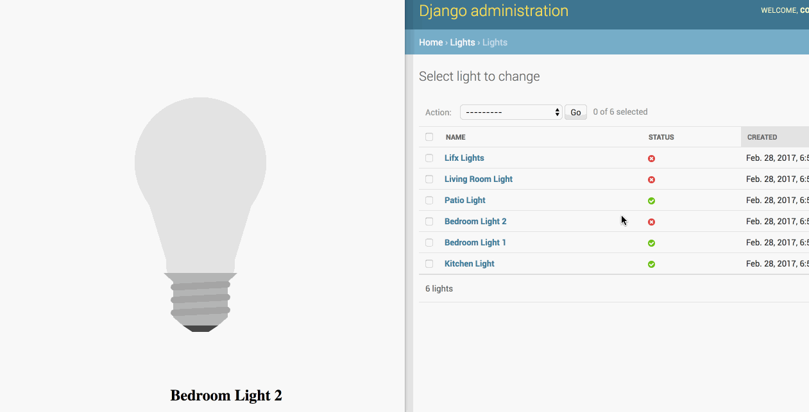

# Django Channels Light Control

Demo app using django channels to control(turn on and off) some lights 
using the WebSockets protocol.

This was created for Python St. Petersburg (https://www.meetup.com/Saint-Petersburg-Python-Meetup/).

## Demo

